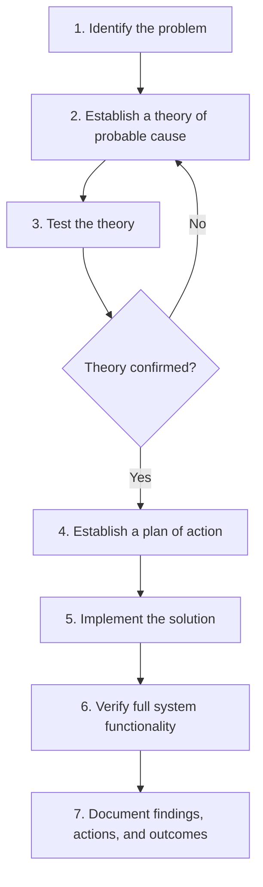

# Network+ Commands Reference 📡

A complete, beginner-friendly command reference guide for anyone studying for the **CompTIA Network+ (N10-009)** certification. This guide explains every major networking command used in **Windows**, **Linux**, and **Cisco IOS**, in simple language, with real syntax, examples, and troubleshooting tips.

  

---

## Table of Contents

- [Introduction](#introduction)
- [How to Use This Guide](#how-to-use-this-guide)
- [Windows Networking Commands](#windows-networking-commands)
- [Linux Networking Commands](#linux-networking-commands)
- [DNS Troubleshooting Commands](#dns-troubleshooting-commands)
- [Routing Commands](#routing-commands)
- [Security Related Commands](#security-related-commands)
- [Cisco IOS Commands](#cisco-ios-commands)
- [Network Troubleshooting Workflow](#network-troubleshooting-workflow)
- [Command Comparison Tables](#command-comparison-tables)
- [Best Practices](#best-practices)
- [Additional Resources](#additional-resources)

---

## Introduction

Networking is mostly about **talking to devices and asking them questions** — "Are you alive?", "What's your IP?", "How do I get to you?", "Who owns this domain?" Every command in this guide answers one of those questions.

This document is built for:
- Students preparing for the **CompTIA Network+** exam
- Junior network/system administrators
- Anyone who wants a single reference for Windows, Linux, and Cisco commands

Each command below includes:
1. **What it does** (in plain English)
2. **When to use it**
3. **Syntax and common switches**
4. **Real example + sample output**
5. **Common troubleshooting scenarios**

---

## How to Use This Guide

- Use `Ctrl+F` (or the Table of Contents) to jump to a command.
- Try every command yourself in a lab (Packet Tracer, GNS3, a home VM, or a Raspberry Pi) — reading is not the same as doing.
- The tables give you a fast summary; the text below each table gives you the deep explanation.

---

## Windows Networking Commands

### Quick Reference Table

| Command | Purpose | Syntax | Example |
|---|---|---|---|
| `ping` | Test reachability | `ping [-t] [-n count] target` | `ping -n 4 8.8.8.8` |
| `tracert` | Trace the path to a host | `tracert [-d] target` | `tracert google.com` |
| `ipconfig` | Show/manage IP configuration | `ipconfig [/all]` | `ipconfig /all` |
| `netstat` | Show connections/ports | `netstat [-a] [-n] [-o]` | `netstat -ano` |
| `arp` | View/manage the ARP cache | `arp -a` | `arp -a` |
| `route` | View/manage the routing table | `route print` | `route print` |
| `pathping` | Combine ping + tracert | `pathping target` | `pathping 8.8.8.8` |
| `getmac` | Show MAC addresses | `getmac /v` | `getmac /v` |
| `net use` | Manage network shares/drives | `net use X: \\server\share` | `net use Z: \\fileserver\data` |
| `netsh` | Configure network settings | `netsh interface ip ...` | `netsh interface ip show config` |

---

### `ping` (Windows)

**What it does:** Sends ICMP Echo Request packets to a target and waits for Echo Replies to confirm the host is reachable and to measure latency.

**When to use it:** First step in almost every troubleshooting flow — "Is the destination even up?"

**Syntax:**
```
ping [-t] [-a] [-n count] [-l size] [-f] [-i TTL] target_name
```

| Switch | Meaning |
|---|---|
| `-t` | Ping until stopped manually (Ctrl+C) |
| `-n count` | Number of echo requests to send |
| `-l size` | Send buffer size (packet size) |
| `-f` | Set "Don't Fragment" flag |
| `-a` | Resolve addresses to hostnames |
| `-i TTL` | Set Time To Live |

**Example:**
```
C:\> ping -n 4 8.8.8.8
```

**Sample Output:**
```
Pinging 8.8.8.8 with 32 bytes of data:
Reply from 8.8.8.8: bytes=32 time=14ms TTL=117
Reply from 8.8.8.8: bytes=32 time=13ms TTL=117
Reply from 8.8.8.8: bytes=32 time=15ms TTL=117
Reply from 8.8.8.8: bytes=32 time=13ms TTL=117

Ping statistics for 8.8.8.8:
    Packets: Sent = 4, Received = 4, Lost = 0 (0% loss),
Approximate round trip times in milli-seconds:
    Minimum = 13ms, Maximum = 15ms, Average = 13ms
```

**Troubleshooting scenarios:**
- `Request timed out` → host is down, a firewall is blocking ICMP, or there's a routing problem.
- `Destination host unreachable` → your local machine has no route to that network.
- High/variable latency → possible congestion or a saturated link.

---

### `tracert` (Windows)

**What it does:** Shows every router (hop) a packet passes through on its way to the destination, along with the round-trip time to each hop.

**When to use it:** When `ping` fails or is slow, and you need to know **where** along the path the problem is.

**Syntax:**
```
tracert [-d] [-h max_hops] [-w timeout] target_name
```

| Switch | Meaning |
|---|---|
| `-d` | Do not resolve hostnames (faster) |
| `-h` | Maximum number of hops to search |
| `-w` | Timeout per reply (ms) |

**Example:**
```
C:\> tracert -d google.com
```

**Sample Output:**
```
Tracing route to google.com [142.250.72.14]
over a maximum of 30 hops:

  1     1 ms     1 ms     1 ms  192.168.1.1
  2    10 ms     9 ms    10 ms  10.10.0.1
  3    15 ms    14 ms    15 ms  142.250.72.14
```

**Troubleshooting scenarios:**
- A hop that shows `* * *` repeatedly (and stays that way to the end) usually just means that router doesn't respond to ICMP — not necessarily a failure.
- A sudden latency spike at one hop points to a congested or misconfigured link at that specific router.

---

### `ipconfig`

**What it does:** Displays (and can renew/release) the IP configuration of Windows network adapters.

**When to use it:** To check your own IP address, subnet mask, default gateway, or DNS servers, and to fix DHCP issues.

**Syntax:**
```
ipconfig [/all] [/release] [/renew] [/flushdns] [/displaydns]
```

| Switch | Meaning |
|---|---|
| `/all` | Full details (MAC, DHCP, DNS, etc.) |
| `/release` | Release the current DHCP lease |
| `/renew` | Request a new DHCP lease |
| `/flushdns` | Clear the local DNS resolver cache |
| `/displaydns` | Show cached DNS entries |

**Example:**
```
C:\> ipconfig /all
```

**Sample Output (trimmed):**
```
Ethernet adapter Ethernet:
   IPv4 Address. . . . . . . . . . . : 192.168.1.25
   Subnet Mask . . . . . . . . . . . : 255.255.255.0
   Default Gateway . . . . . . . . . : 192.168.1.1
   DHCP Server . . . . . . . . . . . : 192.168.1.1
   DNS Servers . . . . . . . . . . . : 8.8.8.8
```

**Troubleshooting scenarios:**
- IP address `169.254.x.x` → **APIPA** address, meaning DHCP failed. Try `ipconfig /release` then `/renew`.
- Wrong DNS server cached → `ipconfig /flushdns`.

---

### `netstat`

**What it does:** Displays active TCP/UDP connections, listening ports, and (with `-o`) the process ID using each connection.

**Syntax:**
```
netstat [-a] [-n] [-o] [-b] [-r]
```

| Switch | Meaning |
|---|---|
| `-a` | Show all connections and listening ports |
| `-n` | Show addresses/ports numerically (no DNS lookup) |
| `-o` | Show the owning process ID (PID) |
| `-b` | Show the executable involved (needs admin) |
| `-r` | Show the routing table |

**Example:**
```
C:\> netstat -ano | findstr :443
```

**Troubleshooting scenarios:**
- A port stuck in `LISTENING` but the app won't start → another process is already using it; find the PID with `-o` and check it in Task Manager.
- Many connections in `TIME_WAIT` → normal after high connection turnover, but excessive amounts can indicate a connection-handling problem in an application.

---

### `arp`

**What it does:** Shows and manages the **ARP cache** — the mapping between IP addresses and MAC addresses on the local network.

**Syntax:**
```
arp -a
arp -d [ip_address]
arp -s ip_address mac_address
```

**Example:**
```
C:\> arp -a
```

**Sample Output:**
```
Interface: 192.168.1.25 --- 0x9
  Internet Address      Physical Address      Type
  192.168.1.1            00-14-22-01-23-45     dynamic
  192.168.1.10           ac-de-48-00-11-22     dynamic
```

**Troubleshooting scenarios:**
- Duplicate IP on the network → same IP mapped to two different MAC addresses over time.
- Stale/incorrect entry → clear it with `arp -d` and let it re-learn.

---

### `route`

**What it does:** Views and edits the local routing table, telling Windows which gateway to use for which destination network.

**Syntax:**
```
route print
route add destination mask subnetmask gateway
route delete destination
```

**Example:**
```
C:\> route add 10.10.0.0 mask 255.255.0.0 192.168.1.254
```

**Troubleshooting scenarios:**
- A host can reach some networks but not others → check `route print` for a missing or incorrect route.

---

### `pathping`

**What it does:** Combines the functionality of `ping` and `tracert` — it traces the path *and* gathers packet loss statistics per hop over time.

**Syntax:**
```
pathping [-n] [-h max_hops] target
```

**Example:**
```
C:\> pathping 8.8.8.8
```

**When to use it:** When you suspect intermittent packet loss at a specific hop rather than a total outage — `pathping` takes longer than `tracert` but gives much more detail on loss percentage per hop.

---

### `getmac`

**What it does:** Displays the MAC address(es) of all network adapters on the local machine.

**Syntax:**
```
getmac /v /fo list
```

**Example:**
```
C:\> getmac /v
```

**When to use it:** For MAC filtering setup, asset inventory, or verifying which physical adapter is active.

---

### `net use`

**What it does:** Connects to, disconnects from, and lists shared network resources (mapped drives, printers).

**Syntax:**
```
net use Z: \\server\sharename /persistent:yes
net use Z: /delete
```

**Example:**
```
C:\> net use Z: \\fileserver\data
```

**Troubleshooting scenarios:**
- `System error 53` → the server name can't be resolved or SMB (port 445) is blocked.
- `System error 5` → access denied; check credentials/permissions.

---

### `netsh`

**What it does:** A powerful command-line utility to configure almost every network setting in Windows (IP addressing, firewall, Wi-Fi, WinHTTP proxy, etc.).

**Syntax:**
```
netsh interface ip show config
netsh interface ip set address name="Ethernet" static 192.168.1.50 255.255.255.0 192.168.1.1
netsh wlan show profiles
netsh advfirewall set allprofiles state on
```

**When to use it:** Scripting network configuration, resetting a broken TCP/IP stack (`netsh int ip reset`), or managing the Windows Firewall from the CLI.

---

## Linux Networking Commands

### Quick Reference Table

| Command | Purpose | Syntax | Example |
|---|---|---|---|
| `ping` | Test reachability | `ping [-c count] target` | `ping -c 4 8.8.8.8` |
| `traceroute` | Trace path to a host | `traceroute target` | `traceroute google.com` |
| `ifconfig` | Legacy interface config | `ifconfig [iface]` | `ifconfig eth0` |
| `ip` | Modern interface/route config | `ip addr / ip route / ip link` | `ip addr show` |
| `netstat` | Legacy connection viewer | `netstat -tulnp` | `netstat -tulnp` |
| `ss` | Modern socket statistics | `ss -tulnp` | `ss -tulnp` |
| `arp` | View ARP cache | `arp -a` | `arp -a` |
| `route` | Legacy routing table view | `route -n` | `route -n` |
| `lsof` | List open files/ports | `lsof -i :port` | `lsof -i :22` |
| `systemctl` | Manage services | `systemctl status service` | `systemctl status sshd` |
| `journalctl` | View system logs | `journalctl -u service` | `journalctl -u networking` |
| `ethtool` | NIC diagnostics/settings | `ethtool iface` | `ethtool eth0` |
| `mtr` | Live ping + traceroute | `mtr target` | `mtr google.com` |
| `tcpdump` | Packet capture | `tcpdump -i iface` | `tcpdump -i eth0 port 80` |
| `nmap` | Port/host scanning | `nmap [options] target` | `nmap -sV 192.168.1.0/24` |
| `netcat (nc)` | Raw TCP/UDP connections | `nc [options] host port` | `nc -zv 192.168.1.1 22` |

---

### `ping` (Linux)

**What it does:** Same purpose as Windows `ping` — sends ICMP Echo Requests to check reachability and latency.

**Syntax:**
```
ping [-c count] [-i interval] [-s size] target
```

| Switch | Meaning |
|---|---|
| `-c count` | Number of packets to send (Linux doesn't stop automatically like Windows) |
| `-i` | Interval between packets (seconds) |
| `-s` | Packet size in bytes |

**Example:**
```
$ ping -c 4 8.8.8.8
```

**Key difference from Windows:** On Linux, `ping` runs **forever** by default until you press `Ctrl+C`, unless you specify `-c`.

---

### `traceroute`

**What it does:** The Linux equivalent of `tracert` — shows the hop-by-hop path to a destination. Uses **UDP** packets by default (Windows `tracert` uses ICMP).

**Syntax:**
```
traceroute [-I] [-T] [-n] target
```

| Switch | Meaning |
|---|---|
| `-I` | Use ICMP echo instead of UDP |
| `-T` | Use TCP SYN packets (useful when UDP/ICMP is firewalled) |
| `-n` | Don't resolve hostnames |

**Example:**
```
$ traceroute -n google.com
```

**Troubleshooting scenarios:**
- All hops timing out but the destination is reachable via `ping` → firewall is blocking UDP; try `-I` or `-T`.

---

### `ifconfig` (legacy)

**What it does:** Displays and configures network interface parameters (IP, netmask, MAC, status). **Deprecated** in favor of `ip`, but still common on older systems and the exam.

**Syntax:**
```
ifconfig [interface] [up|down]
ifconfig eth0 192.168.1.50 netmask 255.255.255.0
```

**Example:**
```
$ ifconfig eth0
```

**Sample Output:**
```
eth0: flags=4163<UP,BROADCAST,RUNNING,MULTICAST>  mtu 1500
        inet 192.168.1.50  netmask 255.255.255.0  broadcast 192.168.1.255
        ether 08:00:27:aa:bb:cc  txqueuelen 1000  (Ethernet)
```

---

### `ip` (modern replacement)

**What it does:** The modern, all-in-one replacement for `ifconfig`, `route`, and `arp`. Part of the `iproute2` suite.

**Syntax:**
```
ip addr show
ip link set eth0 up
ip route show
ip route add 10.0.0.0/24 via 192.168.1.254
ip neigh show
```

| Sub-command | Purpose |
|---|---|
| `ip addr` | Show/manage IP addresses (replaces `ifconfig`) |
| `ip link` | Show/manage interface state (up/down, MTU) |
| `ip route` | Show/manage routing table (replaces `route`) |
| `ip neigh` | Show ARP/neighbor table (replaces `arp -a`) |

**Example:**
```
$ ip addr show eth0
$ ip route add default via 192.168.1.1
```

**Troubleshooting scenarios:**
- Interface shows `state DOWN` in `ip link show` → bring it up with `ip link set eth0 up`.
- No default route → add one with `ip route add default via <gateway>`.

---

### `netstat` (Linux) vs `ss`

**What it does:** `netstat` shows active connections, listening ports, and routing info. `ss` (socket statistics) is the faster, modern replacement, since `netstat` is deprecated on many distros.

**Syntax:**
```
netstat -tulnp
ss -tulnp
```

| Switch | Meaning |
|---|---|
| `-t` | TCP sockets |
| `-u` | UDP sockets |
| `-l` | Listening sockets only |
| `-n` | Numeric (no DNS resolution) |
| `-p` | Show the owning process |

**Example:**
```
$ ss -tulnp
```

**Troubleshooting scenarios:**
- A service won't bind to its port → check if something else already owns it with `ss -tulnp | grep <port>`.

---

### `arp` / `ip neigh`

**What it does:** Shows the local ARP (IPv4) / neighbor (IPv6) cache mapping IPs to MAC addresses.

**Syntax:**
```
arp -a
ip neigh show
```

---

### `route -n` (legacy)

**What it does:** Displays the kernel routing table (numeric form, no DNS lookups).

**Syntax:**
```
route -n
```

**Note:** On modern distros, use `ip route show` instead.

---

### `lsof`

**What it does:** "List Open Files" — in Linux, everything is a file, including network sockets, so `lsof` can show which process owns which network connection.

**Syntax:**
```
lsof -i :port
lsof -i tcp
lsof -u username
```

**Example:**
```
$ lsof -i :443
```

**Troubleshooting scenarios:**
- "Address already in use" errors when starting a service → find and kill the process holding the port.

---

### `systemctl`

**What it does:** Controls **systemd** services — start, stop, restart, enable, and check the status of networking-related daemons (SSH, NetworkManager, firewalld, etc.).

**Syntax:**
```
systemctl status sshd
systemctl restart NetworkManager
systemctl enable firewalld
systemctl stop sshd
```

**Example:**
```
$ systemctl status sshd
```

**Troubleshooting scenarios:**
- A network service seems "installed" but not working → check `systemctl status <service>` for `failed` or `inactive (dead)`.

---

### `journalctl`

**What it does:** Reads the systemd journal (system logs) — essential for debugging why a network service failed to start.

**Syntax:**
```
journalctl -u sshd
journalctl -xe
journalctl --since "10 minutes ago"
```

**Example:**
```
$ journalctl -u NetworkManager -f
```

(`-f` follows the log live, like `tail -f`.)

---

### `ethtool`

**What it does:** Queries and configures low-level Ethernet NIC settings: link speed, duplex mode, auto-negotiation, and driver info.

**Syntax:**
```
ethtool eth0
ethtool -s eth0 speed 1000 duplex full autoneg off
```

**Example:**
```
$ ethtool eth0
```

**Troubleshooting scenarios:**
- Slow network performance → check for a **duplex mismatch** (e.g., one side full-duplex, the other half-duplex) with `ethtool`.
- `Link detected: no` → cable, port, or switch-side issue.

---

### `mtr`

**What it does:** "My Traceroute" — combines `ping` and `traceroute` into a single continuously-updating live view, showing loss % and latency per hop in real time.

**Syntax:**
```
mtr target
mtr -r -c 10 target   # report mode, 10 cycles
```

**Example:**
```
$ mtr -r -c 10 google.com
```

**When to use it:** Best tool for diagnosing **intermittent** issues, since it keeps sampling over time instead of a single snapshot like `tracert`.

---

### `tcpdump`

**What it does:** Captures raw network packets on an interface for deep packet-level analysis — the command-line version of Wireshark.

**Syntax:**
```
tcpdump -i eth0
tcpdump -i eth0 port 80
tcpdump -i eth0 host 192.168.1.10 -w capture.pcap
```

| Switch | Meaning |
|---|---|
| `-i` | Interface to capture on |
| `-w` | Write capture to a file (for Wireshark later) |
| `-n` | Don't resolve hostnames |
| `port` / `host` | Filter by port or host |

**Example:**
```
$ tcpdump -i eth0 port 443 -c 20
```

**Troubleshooting scenarios:**
- Suspect an app isn't actually sending traffic → capture on the interface and confirm packets are (or aren't) leaving.
- Confirm whether a firewall is silently dropping traffic (SYN sent, no SYN-ACK returned).

---

### `nmap`

**What it does:** Scans hosts and networks to discover live hosts, open ports, running services, and even OS fingerprints. A core security/troubleshooting tool.

**Syntax:**
```
nmap 192.168.1.1
nmap -sV 192.168.1.0/24
nmap -p 1-1000 192.168.1.10
nmap -O target
```

| Switch | Meaning |
|---|---|
| `-sV` | Detect service versions |
| `-p` | Specify port range |
| `-O` | Attempt OS detection |
| `-sS` | Stealth SYN scan |
| `-A` | Aggressive scan (OS, version, script, traceroute) |

**Example:**
```
$ nmap -sV -p 22,80,443 192.168.1.10
```

**Troubleshooting scenarios:**
- Verify a port that should be open (e.g., web server on 80/443) is actually reachable from the network.
- Discover unexpected/rogue devices or open ports on the LAN.

> ⚠️ **Note:** Only scan networks/hosts you own or have explicit permission to test.

---

### `netcat` (`nc`)

**What it does:** A flexible "Swiss army knife" for reading/writing raw data over TCP/UDP connections — often used to quickly test if a specific port is open.

**Syntax:**
```
nc -zv host port
nc -l -p 4444          # listen on a port
nc host port           # connect to a port
```

| Switch | Meaning |
|---|---|
| `-z` | Zero-I/O mode (just test the port, don't send data) |
| `-v` | Verbose |
| `-l` | Listen mode |

**Example:**
```
$ nc -zv 192.168.1.10 22
```

**When to use it:** Quick manual test of whether a specific TCP/UDP port is reachable, without needing a full scanner like `nmap`.

---

## DNS Troubleshooting Commands

| Command | OS | Purpose | Example |
|---|---|---|---|
| `nslookup` | Windows/Linux | Query DNS records interactively | `nslookup google.com` |
| `dig` | Linux/macOS | Detailed, scriptable DNS lookups | `dig google.com MX` |
| `host` | Linux | Quick, simple DNS lookup | `host google.com` |
| `whois` | Linux/Windows | Domain registration lookup | `whois google.com` |

### `nslookup`

**What it does:** Queries DNS servers to resolve hostnames to IP addresses (or vice versa) and to check specific record types.

**Syntax:**
```
nslookup domain
nslookup -type=MX domain
nslookup domain dns_server
```

**Example:**
```
$ nslookup -type=MX gmail.com
```

**Troubleshooting scenarios:**
- Domain resolves on one DNS server but not another → compare results by specifying different DNS servers.
- `nslookup` works but browsing fails → the problem may be beyond DNS (e.g., a firewall or routing issue), since name resolution is confirmed to be fine.

---

### `dig` (Domain Information Groper)

**What it does:** The modern, more detailed Linux/macOS DNS lookup tool. Preferred by professionals for scripting and deep DNS troubleshooting.

**Syntax:**
```
dig domain
dig domain MX
dig +short domain
dig @8.8.8.8 domain
dig -x 8.8.8.8   # reverse lookup
```

**Example:**
```
$ dig google.com +short
```

**Sample Output:**
```
;; ANSWER SECTION:
google.com.   231   IN   A   142.250.72.14
```

**Troubleshooting scenarios:**
- Use `dig +trace` to follow the full resolution path from root servers down, to find exactly where DNS resolution breaks.

---

### `host`

**What it does:** A simple command for quick forward and reverse DNS lookups — less detailed than `dig`, faster to read.

**Syntax:**
```
host domain
host IP_address   # reverse lookup
```

**Example:**
```
$ host google.com
```

---

### `whois`

**What it does:** Looks up domain registration information — owner, registrar, creation/expiration date, name servers.

**Syntax:**
```
whois domain
```

**Example:**
```
$ whois example.com
```

**When to use it:** Checking if a domain has expired, who registered it, or which name servers it's supposed to be using.

---

## Routing Commands

| Command | OS | Purpose | Example |
|---|---|---|---|
| `route print` | Windows | View routing table | `route print` |
| `route -n` / `ip route` | Linux | View routing table | `ip route show` |
| `show ip route` | Cisco IOS | View router's routing table | `show ip route` |
| `ip route add` | Cisco IOS (config) | Add a static route | `ip route 10.0.0.0 255.0.0.0 192.168.1.1` |

**Core concept:** A routing table tells a device "for this destination network, send traffic out this interface/gateway." Every OS keeps one, even end-user PCs.

**Common troubleshooting scenarios:**
- A host can reach the local subnet but nothing else → missing or incorrect **default gateway**.
- Traffic reaches a router but doesn't come back → **asymmetric routing** (return path uses a different route).
- Static route not working → check the mask; a wrong subnet mask silently breaks matching.

---

## Security Related Commands

| Command | OS | Purpose | Example |
|---|---|---|---|
| `ssh` | Linux/Windows | Secure encrypted remote shell | `ssh user@192.168.1.10` |
| `telnet` | Linux/Windows/Cisco | Unencrypted remote shell (legacy/testing) | `telnet 192.168.1.1 23` |
| `nmap` | Linux | Port/vulnerability scanning | `nmap -sV target` |
| `tcpdump` | Linux | Packet capture/analysis | `tcpdump -i eth0` |
| `curl` | Linux/Windows | Transfer data / test HTTP(S) endpoints | `curl -I https://example.com` |
| `wget` | Linux | Download files over HTTP/FTP | `wget https://example.com/file.zip` |

### `ssh`

**What it does:** Opens an encrypted remote terminal session to another device — the secure replacement for Telnet.

**Syntax:**
```
ssh user@host
ssh -p 2222 user@host
ssh -i keyfile.pem user@host
```

**Example:**
```
$ ssh admin@192.168.1.1
```

**Troubleshooting scenarios:**
- `Connection refused` → SSH service isn't running, or a firewall is blocking port 22.
- `Permission denied (publickey)` → key-based auth misconfiguration, wrong key, or wrong permissions on the key file.

---

### `telnet`

**What it does:** Opens a **plaintext** (unencrypted) remote session. Still useful in Network+ contexts to manually test if a TCP port is open (e.g., `telnet host 80`).

**Syntax:**
```
telnet host port
```

**Example:**
```
$ telnet 192.168.1.1 23
```

> ⚠️ Telnet sends credentials in plaintext — avoid using it for real remote administration; SSH should be used instead. It's still handy purely as a **port connectivity tester**.

---

### `curl`

**What it does:** Transfers data to/from a server using many protocols (HTTP, HTTPS, FTP). Extremely useful to test if a web service is actually responding.

**Syntax:**
```
curl https://example.com
curl -I https://example.com   # headers only
curl -v https://example.com   # verbose/debug
```

**Example:**
```
$ curl -I https://example.com
```

**Troubleshooting scenarios:**
- Confirm whether an HTTP(S) service is up and what status code it returns (200, 404, 500, etc.), separate from DNS or ping issues.

---

### `wget`

**What it does:** Downloads files from the web (HTTP/HTTPS/FTP), commonly used in Linux scripting.

**Syntax:**
```
wget URL
wget -O output_name URL
```

**Example:**
```
$ wget https://example.com/file.iso
```

---

## Cisco IOS Commands

### Cisco `show` Commands

| Command | Purpose | Example |
|---|---|---|
| `show running-config` | View the active (in-memory) configuration | `show running-config` |
| `show startup-config` | View the saved config that loads on boot | `show startup-config` |
| `show ip interface brief` | Quick summary of interface status/IPs | `show ip interface brief` |
| `show interfaces` | Detailed interface stats (errors, drops, speed) | `show interfaces gi0/1` |
| `show ip route` | View the routing table | `show ip route` |
| `show vlan brief` | View VLAN assignments | `show vlan brief` |
| `show spanning-tree` | View STP status/root bridge | `show spanning-tree` |
| `show cdp neighbors` | View directly connected Cisco devices | `show cdp neighbors detail` |
| `show mac address-table` | View the switch's MAC table | `show mac address-table` |
| `show access-lists` | View configured ACLs | `show access-lists` |
| `show version` | View IOS version and hardware info | `show version` |

**`show ip interface brief` sample output:**
```
Interface              IP-Address      OK? Method Status                Protocol
GigabitEthernet0/0     192.168.1.1     YES manual up                    up
GigabitEthernet0/1     unassigned      YES unset  administratively down down
```

**Troubleshooting scenarios:**
- Interface shows `administratively down` → someone (or a script) issued `shutdown` on it; fix with `no shutdown` in interface config mode.
- Interface shows `up/down` (protocol down) → Layer 1 is fine but Layer 2 isn't — check encapsulation, keepalives, or the far end of the link.

---

### Cisco Configuration Commands (Global Modes)

| Mode | How to Enter | Prompt Example |
|---|---|---|
| User EXEC | (default on login) | `Router>` |
| Privileged EXEC | `enable` | `Router#` |
| Global Configuration | `configure terminal` | `Router(config)#` |
| Interface Configuration | `interface gi0/1` | `Router(config-if)#` |
| Line Configuration | `line vty 0 4` | `Router(config-line)#` |

**Common configuration commands:**
```
enable
configure terminal
hostname R1
enable secret Cisco123
interface gi0/0
 ip address 192.168.1.1 255.255.255.0
 no shutdown
exit
write memory        ! saves running-config to startup-config
```

---

### VLAN Commands

**What it does:** Creates and assigns VLANs (Virtual LANs) to segment a switch into separate broadcast domains.

**Syntax:**
```
configure terminal
vlan 10
 name SALES
exit
interface fa0/1
 switchport mode access
 switchport access vlan 10
exit
```

**Trunk configuration (carries multiple VLANs between switches):**
```
interface gi0/1
 switchport mode trunk
 switchport trunk allowed vlan 10,20,30
```

**Verify:**
```
show vlan brief
show interfaces trunk
```

**Troubleshooting scenarios:**
- A device can't reach others in the same VLAN → check `show vlan brief` to confirm the port is actually assigned correctly.
- Devices in different VLANs can't communicate at all → expected behavior; they need a Layer 3 device (router or L3 switch) to route between VLANs (**Router-on-a-Stick** or SVIs).

---

### Interface Commands

```
interface gi0/0
 description Link-to-Core-Switch
 ip address 10.0.0.1 255.255.255.0
 no shutdown
 speed 1000
 duplex full
```

**Verify:**
```
show interfaces gi0/0
show ip interface brief
```

**Troubleshooting scenarios:**
- Frequent CRC errors in `show interfaces` output → bad cable, bad port, or duplex mismatch.
- Interface flapping (up/down repeatedly) → often a cabling, power, or SFP module issue.

---

### Routing Commands (Cisco)

**Static routing:**
```
ip route 10.10.0.0 255.255.0.0 192.168.1.254
```

**Dynamic routing (example: OSPF):**
```
router ospf 1
 network 192.168.1.0 0.0.0.255 area 0
```

**Dynamic routing (example: EIGRP):**
```
router eigrp 100
 network 192.168.1.0 0.0.0.255
```

**Verify:**
```
show ip route
show ip protocols
show ip ospf neighbor
```

**Troubleshooting scenarios:**
- Routes missing from `show ip route` → check the `network` statements match the actual interface subnet and wildcard mask exactly.
- Neighbors not forming (`show ip ospf neighbor` empty) → mismatched area IDs, hello/dead timers, or an ACL blocking the routing protocol.

---

### DHCP Commands (Cisco)

**Configure a DHCP pool on a router:**
```
ip dhcp pool LAN-POOL
 network 192.168.1.0 255.255.255.0
 default-router 192.168.1.1
 dns-server 8.8.8.8
 lease 7
exit
ip dhcp excluded-address 192.168.1.1 192.168.1.10
```

**Verify:**
```
show ip dhcp binding
show ip dhcp pool
show ip dhcp conflict
```

**Troubleshooting scenarios:**
- Clients aren't getting addresses → check `ip dhcp excluded-address`, or whether a `dhcp relay` (`ip helper-address`) is needed across VLANs/subnets.

---

### DNS Commands (Cisco)

```
ip domain-name mycompany.local
ip name-server 8.8.8.8 8.8.4.4
ip domain-lookup
```

**Verify:**
```
show hosts
show running-config | include name-server
```

**Troubleshooting scenarios:**
- Device pausing for a long time after a mistyped command → `ip domain-lookup` is on and it's trying (and failing) to resolve the "hostname" via DNS; disable with `no ip domain-lookup` in lab environments.

---

### ACL (Access Control List) Commands

**Standard ACL (filters by source IP only):**
```
access-list 10 deny 192.168.1.100
access-list 10 permit any
interface gi0/1
 ip access-group 10 in
```

**Extended ACL (filters by source/destination IP, protocol, port):**
```
access-list 100 permit tcp 192.168.1.0 0.0.0.255 any eq 80
access-list 100 deny ip any any
interface gi0/1
 ip access-group 100 in
```

**Named ACL (modern, easier to read/edit):**
```
ip access-list extended BLOCK-TELNET
 deny tcp any any eq 23
 permit ip any any
```

**Verify:**
```
show access-lists
show ip interface gi0/1   ! shows which ACL is applied
```

**Troubleshooting scenarios:**
- Legitimate traffic being blocked → ACLs process top-down and stop at first match; check ordering, and remember there's an **implicit deny all** at the end of every ACL.
- Standard ACLs should generally be placed close to the **destination**; extended ACLs close to the **source** — placing them wrong can block more (or less) traffic than intended.

---

## Network Troubleshooting Workflow

A simple, repeatable process (based on CompTIA's official troubleshooting methodology):



### Step-by-step with commands

| Step | Goal | Useful Commands |
|---|---|---|
| 1. Identify the problem | Gather symptoms, question users, check recent changes | `ping`, `ipconfig` / `ip addr` |
| 2. Establish a theory | Layer 1? Layer 2? Layer 3? DNS? | OSI model reasoning |
| 3. Test the theory | Confirm reachability and path | `ping`, `tracert`/`traceroute`, `mtr` |
| 4. Plan of action | Decide the fix and impact/rollback plan | — |
| 5. Implement | Apply the fix | `netsh`, `ip route`, Cisco config commands |
| 6. Verify | Confirm the issue is fully resolved | `ping`, `nslookup`/`dig`, `show ip interface brief` |
| 7. Document | Record root cause and resolution | — |

### Layer-by-layer approach (bottom-up)

| OSI Layer | Check | Command Examples |
|---|---|---|
| 1 - Physical | Cable, link light, port status | `show interfaces`, `ethtool` |
| 2 - Data Link | MAC, VLAN, switching | `arp -a`, `show mac address-table`, `show vlan brief` |
| 3 - Network | IP, routing, gateway | `ping`, `ip route`, `show ip route` |
| 4 - Transport | Port reachability | `netstat`/`ss`, `nc -zv`, `telnet host port` |
| 7 - Application | The actual service | `curl`, browser test, app logs |

---

## Command Comparison Tables

### Windows ↔ Linux ↔ Cisco Equivalents

| Task | Windows | Linux | Cisco IOS |
|---|---|---|---|
| Show IP configuration | `ipconfig /all` | `ip addr show` / `ifconfig` | `show ip interface brief` |
| Test connectivity | `ping -n 4` | `ping -c 4` | `ping` |
| Trace path | `tracert` | `traceroute` | `traceroute` |
| Show routing table | `route print` | `ip route show` / `route -n` | `show ip route` |
| Show ARP table | `arp -a` | `arp -a` / `ip neigh show` | `show arp` |
| Show active connections | `netstat -ano` | `ss -tulnp` | `show ip sockets` |
| DNS lookup | `nslookup` | `dig` / `host` | `show hosts` |
| Flush DNS cache | `ipconfig /flushdns` | `resolvectl flush-caches` (systemd) | `clear host` |
| Manage services | Services.msc / `sc` | `systemctl` | N/A |
| View logs | Event Viewer | `journalctl` | `show logging` |

### Windows vs. Linux `ping` Behavior

| Feature | Windows | Linux |
|---|---|---|
| Default behavior | Sends 4 packets, then stops | Runs continuously until `Ctrl+C` |
| Limit count | `-n count` | `-c count` |
| Packet size | `-l size` | `-s size` |

### `tracert` vs `traceroute` Protocol Used

| Tool | Default protocol | Notes |
|---|---|---|
| `tracert` (Windows) | ICMP | Simpler, often blocked less by firewalls |
| `traceroute` (Linux) | UDP | Can switch to ICMP (`-I`) or TCP (`-T`) |

---

## Best Practices

- ✅ **Always start with Layer 1** (is it plugged in / link light on?) before jumping to complex commands.
- ✅ Use **`-n` / numeric flags** (like `netstat -n`, `traceroute -n`) during troubleshooting to skip slow DNS lookups.
- ✅ Save configurations after every change on Cisco devices: `write memory` (or `copy running-config startup-config`).
- ✅ Prefer **SSH over Telnet** for any real device management — Telnet sends everything, including passwords, in plaintext.
- ✅ Use `mtr` instead of a single `ping`/`traceroute` when chasing **intermittent** problems.
- ✅ Document baseline "normal" output (e.g., `show interfaces`, `ipconfig /all`) for critical devices, so you can quickly spot what changed.
- ✅ Only run `nmap`/scanning tools on networks you own or are authorized to test.
- ✅ Practice commands in a real lab (Packet Tracer, GNS3, EVE-NG, or a home VM lab) — the exam tests applied knowledge, not memorization alone.
- ✅ Learn the **OSI model** deeply; almost every troubleshooting command maps to a specific layer.

---

## Additional Resources

- [CompTIA Network+ Official Exam Objectives](https://www.comptia.org/certifications/network)
- [Cisco Networking Academy (Packet Tracer)](https://www.netacad.com/)
- [Linux `man` pages](https://man7.org/linux/man-pages/) — run `man <command>` locally for authoritative details
- [Microsoft Learn - Windows Networking Commands](https://learn.microsoft.com/en-us/windows-server/networking/)
- [Wireshark / tcpdump documentation](https://www.tcpdump.org/manpages/tcpdump.1.html)
- [Professor Messer's Network+ Study Resources](https://www.professormesser.com/)

---

## Contributing

Found an error or want to add a command? Feel free to open an issue or submit a pull request — this guide is meant to grow as a community study resource.

## License

This document is provided under the MIT License — free to use, copy, and adapt for personal or educational purposes.

---

⭐ If this guide helped you prepare for the Network+ exam, consider starring the repository!
